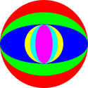

# Chromypal

A simple colour tool to compare swatches and get the various and sundry code formats. From RGB to hex Chromypal will have you covered.
Of course there's many existing services that do exactly this. I find I'm often going to random sites for something simple like this which have ads and trackers, so I'm making my own. It was fun to learn about the different conversions and visualise how each parameter affects the colour.

Check it out at: https://edpacca.github.io/chromypal/

## Future work
I use colours for development but also for miniature-painting. One day I'd like to include a list of all thec commonly used paint ranges with their approximate hex codes: Vallejo, Citadel Colour, AK interactive, Pro Acryl etc. I'd include a tool that takes a palette of colours and finds the closest paints which are available to the user.
